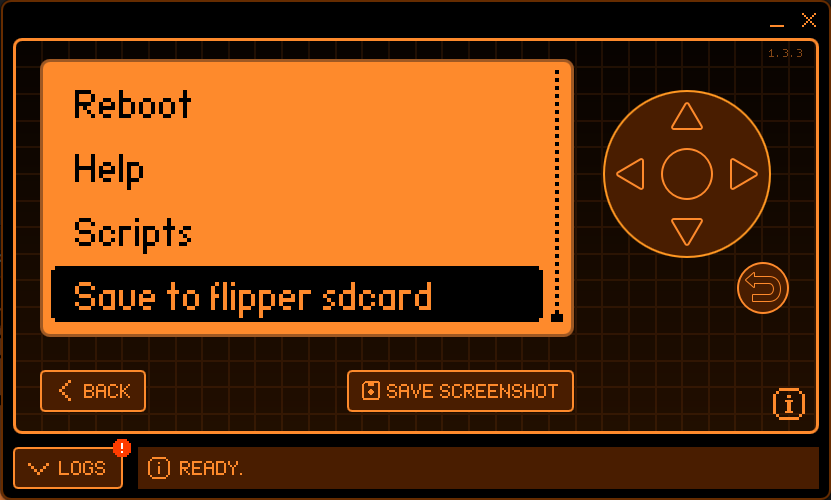

# Hacking WPA/WPA2 Wi-Fi Using Flipper Zero with Developer Board

## Introduction
After getting my Flipper Zero and Developer Board, the first thing I wanted to do with it was hack Wi-Fi. This walkthrough will take you through the steps I took to get it working using a Windows host computer. 

**Requirements**
- Flipper Zero and Wi-Fi enabled Developer Board
- MicroSD card with 16GB+ storage (insert before starting)
- USB-C data cable to connect to your computer
- If this is your first time using your Flipper Zero, you may have to do an initial flash using [qFlipper](https://flipperzero.one/update)

## Flash Flipper Zero with Custom Firmware - RogueMaster
Get the latest version of [RogueMaster](https://github.com/RogueMaster/flipperzero-firmware-wPlugins/releases). I used the web installer version also called Flipper Lab.


If you're using Flipper Lab, select the release version from the drop-down menu, then click INSTALL:


After the flashing is complete you can close the browser tab, disconnect your Flipper Zero, and continue to the next step.

## Flash Wi-Fi Developer Board - Marauder
Get the latest version of [Marauder](https://github.com/UberGuidoZ/Flipper/tree/main/Wifi_DevBoard/FZ_Marauder_Flasher) by downloading the zip file. 

Before completing the instructions from Marauders GitHub page we need to swap a bin file that will allow us to properly save flow logs to our SD card. 

After extracting the Zip file to your computer,  locate the .bin file. For example, My file was here: `C:\Users\Tanner\Downloads\FZ_Marauder_v2.5\Marauder\esp32_marauder_v0_13_3_20231026_flipper.bin`. Take note of the versioning (in this case 13.3).

Now visit justcallmekoko’s [GitHub](https://github.com/justcallmekoko/ESP32Marauder/releases) and download the file ending in “_sd_serial.bin” that aligns with your version of Marauder:


Replace the esp32_marauder_v0_13_3_20231026_flipper.bin file with the esp32_marauder_v0_13_3_20231026_flipper_sd_serrial.bin. Make sure to remove the “_sd_serial” after replacing the file so that the new file has the same name as the original file. 

Now you can follow the directions from UberGuedoZ starting with step 2. 
1. Download and extract [the ZIP file](https://github.com/UberGuidoZ/Flipper/raw/main/Wifi_DevBoard/FZ_Marauder_Flasher/FZ_Marauder_v2.5.zip) above to the same directory.
2. Hold `BOOT` on the devboard and plug it into your PC directly via USB.
3. Double-click `flash.bat` from the extracted files then choose `Flash` or `Update`.
- If you choose `Flash Marauder` the script will locate your board and flash Marauder automatically!
- If you choose `Update Marauder` you'll be taken to the Marauder download location to grab a new version.(Simply download the Flipper BIN file, stick it in the Marauder subfolder by the batch file, and delete the old BIN.)
- If you choose `Save Flipper Blackmagic WiFi settings` your current Blackmagic configuration will be saved.
- If you choose `Flash Flipper Blackmagic` the script will flash the updated v0.1.1 Blackmagic firmware.

This [video](https://www.youtube.com/watch?v=um_acrDaBK4) walks you through the above steps.

After flashing, reboot your Flipper Zero.


## Perform WPA/WPA2 Wi-Fi PMKID Attack
**For this attack to work**
- WPA/WPA2 must be "Personal security (Pre-shared Key)". Other types (eg: Enterprise) are not vulnerable
- The PMKID must be included in the first EAPOL message of the 4 way handshake
- 802.11r and PMKID caching must be enabled

From your Flipper Zero go to Apps > GPIO > ESP32 > “WiFi Marauder” > "Save to flipper sdcard". Enter YES to both prompts:



From the WiFi Marauder menu select “Scan ap”:


Once your scan is finished or you see the network you are targeting, go back to the WiFi Marauder menu and select “List ap”, we should see our target Wi-Fi network in the list:


From the WiFi Marauder menu choose “Select ap” and append the number associated to the target network, then save your changes then press the Back button twice to return to the menu:


Note: Make sure you have at least one device connected to the target network before starting the attack.

From the WiFi Marauder menu find Sniff and arrow over until you see pmkid:


Now select “Target Active (List)” from inside the Sniff PMKID menu:


You should now see your previously selected network being referenced during the attack:


Your connected device should be disconnecting and reconnecting during this process. I let my attack run form +/- 10 seconds. 

Now connect your Flipper Zero to your computer. Use [qFlipper](https://flipperzero.one/update) to download the PCAP file that was created during our Sniff capture from “SD Card/apps_data/marauder/pcaps/”:


## Extracting WPA/WPA2 Handshake from PCAP File and Password Cracking with Hashcat
Before extracting, let's make sure our capture has the correct packets. If you don’t already have Wireshark download it from [here](https://www.wireshark.org/download.html).

Double-click your downloaded PCAP file to open it in Wireshark. From the filter menu enter “eapol”:


We want to see Messages {1..4} of 4 in the info column as seen in the above screenshot. 

Now use [cap2hashcat](https://hashcat.net/cap2hashcat/) by uploading your PCAP file and converting it to a Hashcat-compatible format. 

Download the converted hash file. I renamed mine to HackMe.hc22000. If you don't already have Hashcat installed on your computer you will need to grab the [binary](https://hashcat.net/hashcat/). You will also need a word list like [rockyou.txt](https://github.com/brannondorsey/naive-hashcat/releases/download/data/rockyou.txt).

If your .hc22000 file and your wordlist are in the same directory as your Hashcat binary you can use this command:
```powershell
.\hashcat.exe -m 22000 .\HackMe.hc22000 .\rockyou.txt
```

If the password is simple, as in our example, Hashcat will quickly crack it:


Happy hacking!


